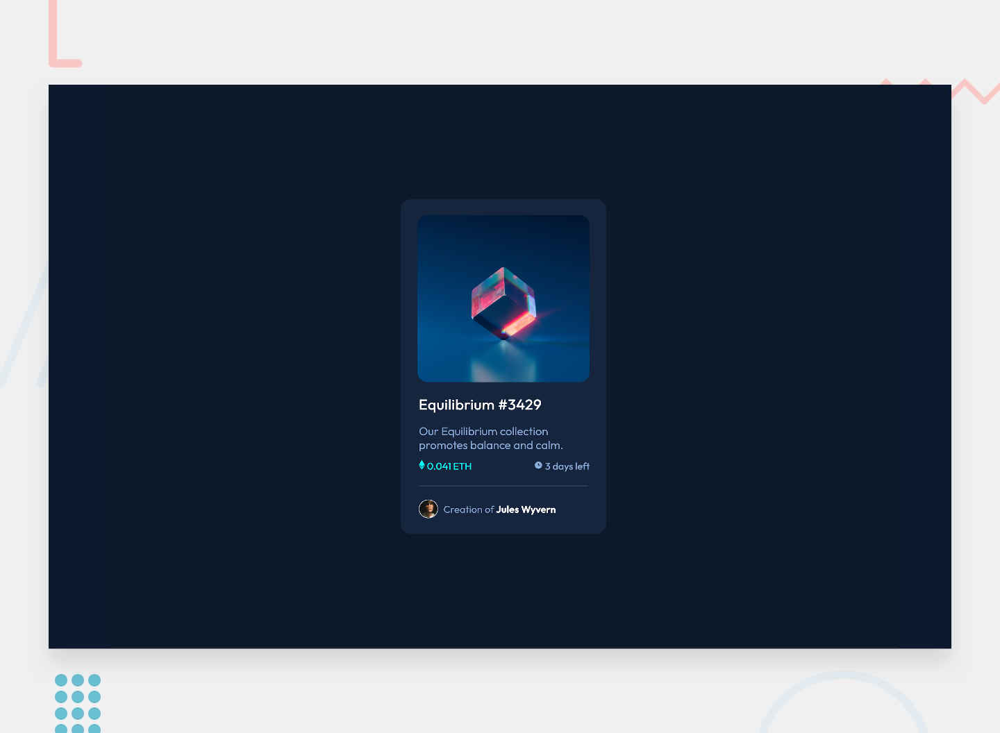

# Frontend Mentor - NFT preview card component

## Things i learnt 👋

- I got more comfortable using CSS Variables.

- Used the 
 tag for the first time.

- Learnt to use overflow: hidden;

- Tried using comments for better readability in the HTML structure.

- Had fun learning.
